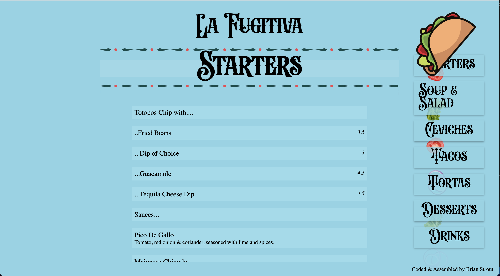

<!-- PROJECT LOGO -->
 

  

<h1>La Fugitiva</h1>

Made with...

<!-- [![React][react.js]][react-url] -->

![HTML5]
![CSS3]
![javascript]

<!-- ![Swiper] -->

 

This purpose of building this site was built to find a free,
                  no-app, easy way to provide a restraurant's updated menu to
                  it's costumers. Post Covid-19, a lot of restraurants returned
                  with digital menus, however I noticed that a lot of them
                  featured pdfs, which made changes really annoying for
                  waitstaff to keep up with. And assuming with that most belts
                  were being tighted in the hospitality business, I wanted to
                  build a site that dynamically builds and updates it's menu
                  with reload items, prices, and descriptions. This is only
                  using a template I built and data from Google Sheets. This
                  would enable a manager to update the price on the spreadsheet
                  from their phone and have it immediately affect how it is
                  displayed in the menu. This site was built with HTML, CSS, and
                  Vanilla Javascript as well as an API for Google Sheets. I used
                  a real menu and information from a restaurant I like in
                  Lisbon.

 

<!-- LICENSE -->

## Licenses and Permissions

This project was made for strictly educational purposes. Though the menu items, prices, and other details were initially taken from the restaurant for accuracy of the demo, this project/site does not currently serve as an accurate representation of the restraurant at this current point. For more information on The restraurant please startby visiting them in person or on Instagram at Instagram.com/lafugitivatacobar.

<!-- CONTACT -->

## Contact

Brian Strout Brianjstrout@Gmail.com

Project Link: [https://https://lafugitiva.netlify.app](https://https://lafugitiva.netlify.app)

<!-- ACKNOWLEDGMENTS -->

## Acknowledgments

#### This site used the follow Apis

- OpenSheet - https://github.com/benborgers/opensheet

#### This Readme was made with components from:

[![shields]][shields-url]

[screenshot]: ./src/images/MashaSiteScreenShot.png
[react.js]: https://img.shields.io/badge/React-20232A?style=for-the-badge&logo=react&logoColor=61DAFB
[react-url]: https://reactjs.org/
[html5]: https://img.shields.io/badge/HTML-20232A?style=for-the-badge&logo=HTML5&logoColor=61DAFB
[css3]: https://img.shields.io/badge/CSS-20232A?style=for-the-badge&logo=CSS3&logoColor=61DAFB
[javascript]: https://img.shields.io/badge/Javascript-20232A?style=for-the-badge&logo=Javascript&logoColor=61DAFB
[framer]: https://img.shields.io/badge/Framer.Motion-20232A?style=for-the-badge&logo=Framer&logoColor=61DAFB
[swiper]: https://img.shields.io/badge/SwiperJS-20232A?style=for-the-badge&logo=Swiper&logoColor=61DAFB
[css3]: https://img.shields.io/badge/CSS-20232A?style=for-the-badge&logo=CSS3&logoColor=61DAFB
[shields]: https://img.shields.io/badge/Shields.io-20232A?style=for-the-badge&logo=Shields.io&logoColor=ffffff00
[shields-url]: https://shields.io

<!-- ?style=for-the-badge&logo=appveyor -->
<!-- 
(<a href="#readme-top">back to top</a>)
 -->
